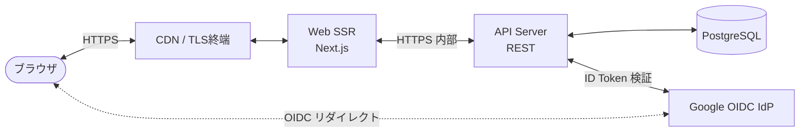

# アーキテクチャ図

Daily Diary の全体構成図（コンポーネント図）。

- ソースファイル: [`component.mmd`](component.mmd)

## 構成要素

| 要素 | 種別 | 役割 |
|---|---|---|
| ブラウザ | クライアント | 利用者の Web ブラウザ |
| CDN | エッジ | 静的アセット配信、TLS終端 |
| Web (SSR) | アプリ | Next.js による画面 SSR・ハイドレーション |
| API Server | アプリ | REST API。認証・認可・ビジネスロジック |
| PostgreSQL | データストア | 利用者・セッション・日記の永続化 |
| Google OIDC | 外部サービス | SSO 認証プロバイダ |

## 図

## 補足

- ブラウザは画面表示中、Web 経由で API を呼ぶ。SSR と CSR の役割分担は実装時に詰める。
- OIDC の認可リクエスト・コールバックは **ブラウザ ↔ Google ↔ Web/API** で行う（ブラウザリダイレクトベース）。
- データベース接続は API 層からのみ。Web 層からは直接アクセスしない。
