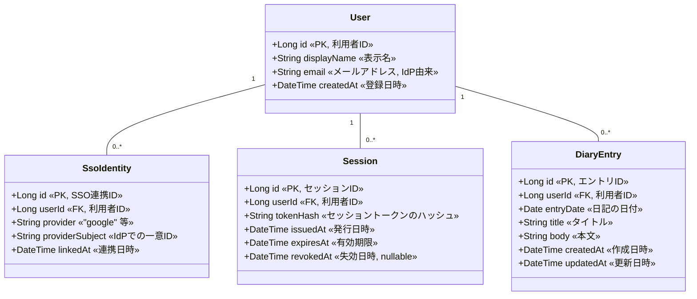

# ドメインモデル（クラス図）

Daily Diary のドメインモデル。同一モデルを Mermaid と PlantUML の両形式で表現する。

| ツール | ファイル |
|---|---|
| Mermaid | 下記埋め込み / [`data-model.mmd`](data-model.mmd) |
| PlantUML | [`data-model.puml`](data-model.puml) |

## エンティティ概要

| エンティティ | 役割 | 集約 |
|---|---|---|
| `User` | 利用者本体 | User 集約のルート |
| `SsoIdentity` | 外部 IdP 連携（provider + providerSubject）| User 集約 |
| `Session` | ログイン状態 | User 集約 |
| `DiaryEntry` | 1日分の日記（`userId + entryDate` でユニーク） | DiaryEntry 集約 |

主な関連:
- `User` 1 : 0..* `SsoIdentity`
- `User` 1 : 0..* `Session`
- `User` 1 : 0..* `DiaryEntry`
- `DiaryEntry` は `userId` で `User` を参照（FK）

## 図（Mermaid）

## 列挙（enum）

| 列挙 | 値 | 備考 |
|---|---|---|
| `SsoProvider` | `google` | MVP は Google のみ。`github` / `apple` は将来 |
| `SessionState`（派生） | `active` / `expired` / `revoked` | `expiresAt` と `revokedAt` から導出。DBカラムにはしない |

## 不変条件

- `DiaryEntry`: `(userId, entryDate)` の組み合わせはユニーク（1日1エントリ制約）
- `SsoIdentity`: `(provider, providerSubject)` の組み合わせはユニーク
- `Session`: `tokenHash` はユニーク、原文は決して保管しない
- `User.email` は IdP からの値をそのまま保持（変更追従は IdP 側に委ねる）

## 将来拡張（MVPスコープ外）

- `EntryRevision`（編集履歴）: 編集前の本文を版管理で保持
- `SsoIdentity` の `provider` を複数対応（GitHub / Apple 等）
- `Attachment`（画像添付）
