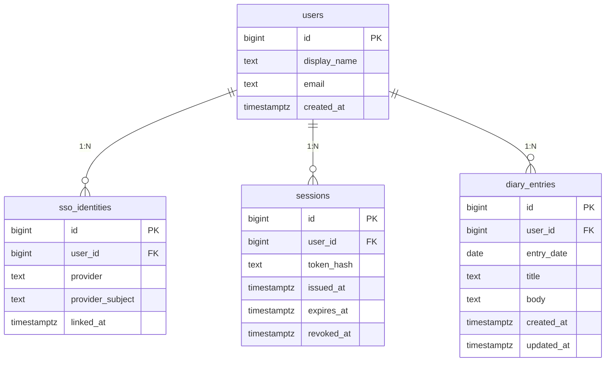

# ER 図（論理データモデル）

Daily Diary のデータベース論理構造。物理（テーブル定義書）は [`detail-design/table/tables.md`](../../detail-design/table/tables.md) を参照。

- ソースファイル: [`er.mmd`](er.mmd)

## テーブル概要

| 物理名 | 論理名 | 主用途 |
|---|---|---|
| `users` | 利用者 | 利用者の本質情報 |
| `sso_identities` | SSO 連携 | 外部 IdP のサブジェクトと利用者の紐付け |
| `sessions` | セッション | サーバ側ログイン状態 |
| `diary_entries` | 日記エントリ | 日記本体 |

## 図

## 主要制約（論理レベル）

| 制約 | 内容 |
|---|---|
| UNIQUE | `sso_identities (provider, provider_subject)` |
| UNIQUE | `sessions (token_hash)` |
| UNIQUE | `diary_entries (user_id, entry_date)` |
| FK | 各子テーブル → `users (id)`（`ON DELETE CASCADE`） |
