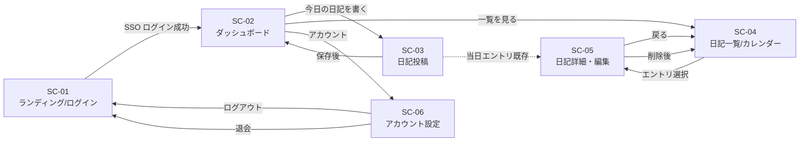

# 画面遷移図

Daily Diary の画面遷移。画面IDは [基本設計書 §2.1](../基本設計書.md#21-画面一覧) と一致。

- ソースファイル: [`screen-flow.mmd`](screen-flow.mmd)

## 凡例

- 実線: 通常遷移
- 点線: 認証・状態による条件遷移

## 図

```mermaid
flowchart LR
    SC01[SC-01<br/>ランディング/ログイン]
    SC02[SC-02<br/>ダッシュボード]
    SC03[SC-03<br/>日記投稿]
    SC04[SC-04<br/>日記一覧/カレンダー]
    SC05[SC-05<br/>日記詳細・編集]
    SC06[SC-06<br/>アカウント設定]

    SC01 -->|SSO ログイン成功| SC02
    SC02 -->|今日の日記を書く| SC03
    SC02 -->|一覧を見る| SC04
    SC02 -->|アカウント| SC06
    SC03 -->|保存後| SC02
    SC03 -.当日エントリ既存.-> SC05
    SC04 -->|エントリ選択| SC05
    SC05 -->|戻る| SC04
    SC05 -->|削除後| SC04
    SC06 -->|ログアウト| SC01
    SC06 -->|退会| SC01
```
