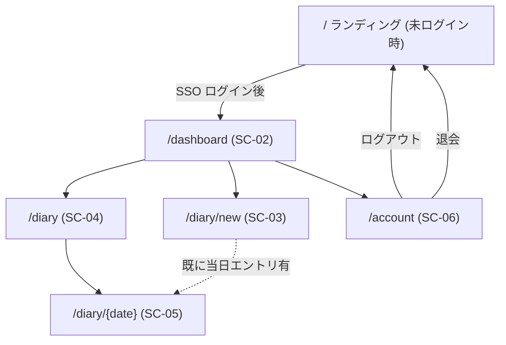

# Information Architecture（情報設計）

Daily Diary のサイト構造・URL 設計・ナビゲーション体系。

## サイトマップ



## URL 一覧

| パス | 画面ID | 認証要否 | 説明 |
|---|---|---|---|
| `/` | SC-01 | 不要（ログイン済みなら自動的に `/dashboard` へ） | ランディング / ログイン起点 |
| `/dashboard` | SC-02 | 必要 | ダッシュボード |
| `/diary/new` | SC-03 | 必要 | 当日の日記投稿 |
| `/diary` | SC-04 | 必要 | 日記一覧（カレンダー） |
| `/diary/{date}` | SC-05 | 必要 | 指定日の日記詳細・編集（`{date}` は `YYYY-MM-DD`） |
| `/account` | SC-06 | 必要 | アカウント設定 |
| `/api/*` | — | API による | API は別系統。[OpenAPI](../detail-design/api/openapi.yaml) 参照 |

## ナビゲーション体系

### グローバルヘッダー（ログイン後・全画面共通）
```
┌──────────────────────────────────────────────┐
│ [Daily Diary]   [今日の日記] [一覧]   [Avatar▼] │
└──────────────────────────────────────────────┘
```
| 要素 | 内容 |
|---|---|
| ロゴ | クリックで `/dashboard` へ |
| 「今日の日記」 | `/diary/new`（当日エントリ未作成）または `/diary/{today}`（既存時） |
| 「一覧」 | `/diary` |
| Avatar メニュー | `/account` / ログアウト |

### フッター
| 要素 | リンク |
|---|---|
| 利用規約 | `/terms`（MVP 対象外、リンク先は静的ページ） |
| プライバシーポリシー | `/privacy` |
| バージョン | フッター右端に小さく表示 |

### ランディング（未ログイン時）
ヘッダーは簡素にロゴ + 「Google でログイン」CTA のみ。

## 認証ガード

| パス | 未認証アクセス時 |
|---|---|
| `/`, `/terms`, `/privacy` | そのまま表示 |
| 上記以外 | `/` にリダイレクト（クエリ `?next=元のパス` を付与し、ログイン後に復帰） |

## ブラウザタイトル規約

`{画面名} — Daily Diary` 形式で統一。
- 例: `ダッシュボード — Daily Diary`、`2026-05-25 の日記 — Daily Diary`

## breadcrumb（パンくず）

MVP では採用しない（階層が浅いため）。将来カテゴリやタグを導入する場合に再検討。
