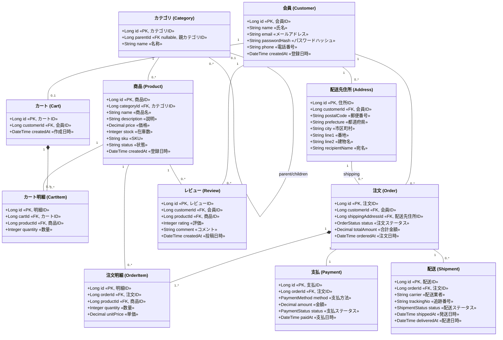

# ECサイト データモデル

同一のデータモデル（クラス図）を複数のツールで表現したものです。エンティティ・属性・関連はすべて揃えてあります。

## エンティティ概要

| エンティティ | 役割 |
|---|---|
| Customer | 会員 |
| Address | 配送先住所（会員に紐づく） |
| Category | 商品カテゴリ（自己参照で階層化） |
| Product | 商品 |
| Cart / CartItem | カートと明細 |
| Order / OrderItem | 注文と明細（注文時の単価をスナップショット保持） |
| Payment | 支払 |
| Shipment | 配送 |
| Review | 商品レビュー |

主な関連は次のとおり（`A 1 : 0..* B` = A 1件に対し B 0件以上）。

- Customer 1 : 0..* Address / Order / Review、1 : 0..1 Cart
- Category 自己参照（親 0..1 : 子 0..*）、Category 1 : 0..* Product
- Cart 1 : 0..* CartItem（コンポジション）、CartItem 0..* : 1 Product
- Order 1 : 1..* OrderItem（コンポジション）、OrderItem 0..* : 1 Product
- Order 1 : 1 Payment、Order 1 : 0..* Shipment、Order 0..* : 1 Address（配送先）

## 列挙（enum）の対応表

図中の列挙値は英語のままにしているため、意味の対応をここで補足する。

### OrderStatus（注文ステータス）

| 値 | 意味 | 補足 |
|---|---|---|
| `PENDING` | 注文受付 | 未払・処理待ちの初期状態 |
| `PAID` | 支払済 | 出荷準備に進める状態 |
| `SHIPPED` | 発送済 | 配送業者に引き渡し済み |
| `DELIVERED` | 配達完了 | 受取人へ到着済み |
| `CANCELLED` | キャンセル | 注文取消し（支払前後を問わず） |

### PaymentMethod（支払方法）

| 値 | 意味 |
|---|---|
| `CREDIT_CARD` | クレジットカード |
| `BANK_TRANSFER` | 銀行振込 |
| `CONVENIENCE_STORE` | コンビニ払い |
| `COD` | 代金引換（Cash On Delivery） |

### PaymentStatus（支払ステータス）

| 値 | 意味 | 補足 |
|---|---|---|
| `UNPAID` | 未払 | 支払依頼前 / 支払待ち |
| `AUTHORIZED` | 与信確保（オーソリ） | カード等で枠を確保した状態 |
| `CAPTURED` | 売上確定 | 実際の課金が完了 |
| `REFUNDED` | 返金済 | 返金処理が完了 |
| `FAILED` | 失敗 | 支払処理が失敗 |

### ShipmentStatus（配送ステータス）

| 値 | 意味 |
|---|---|
| `PREPARING` | 出荷準備中 |
| `SHIPPED` | 発送済 |
| `IN_TRANSIT` | 輸送中 |
| `DELIVERED` | 配達完了 |

## 各ツールの成果物

| ツール | ファイル | 形式 | git差分 |
|---|---|---|---|
| **Mermaid** | 下記埋め込み / [`data-model.mmd`](data-model.mmd) | テキスト | ◎ |
| **PlantUML** | [`data-model.puml`](data-model.puml) | テキスト | ◎ |
| **draw.io** | [`data-model.drawio`](data-model.drawio) | XML | ○（XMLだが手編集は非現実的） |
| **Figma** | （ファイル生成不可・下記参照） | 非公開形式 | × |

### Mermaid（GitHub上でそのまま描画されます）



## 各ツールでの開き方・描画方法

### Mermaid
- GitHub / GitLab / VS Code（拡張）/ Obsidian でコードブロックがそのまま描画される。
- 単体描画は <https://mermaid.live> に `data-model.mmd` を貼り付け。

### PlantUML
- VS Code拡張「PlantUML」、または `plantuml data-model.puml` でPNG/SVG出力。
  ```
  brew install plantuml   # macOS
  plantuml -tsvg docs/design/data-model/data-model.puml
  ```
- オンライン: <https://www.plantuml.com/plantuml>

### draw.io
- <https://app.diagrams.net> で `data-model.drawio` を開く（File → Open）。
- VS Code拡張「Draw.io Integration」でも直接編集可能。

## Figma について（重要）

Figma には **テキストから生成できるオープンなファイル形式がない**（`.fig` は非公開のクラウド/バイナリ形式）ため、PlantUML や draw.io のように成果物ファイルを書き出すことはできません。Figmaで同じ図を扱う場合は「取り込み」になります。

実務的な取り込みルート（おすすめ順）:

1. **SVGをインポート** — PlantUMLまたはdraw.ioからSVGを書き出し、Figmaにドラッグ＆ドロップ。ベクターとして編集可能。
   ```
   plantuml -tsvg docs/design/data-model/data-model.puml   # data-model.svg が生成される
   ```
   draw.io の場合: File → Export as → SVG。
2. **Figmaプラグインを使う** — 「Mermaid」「diagrams.net (draw.io)」などのプラグインで図を取り込む。
3. **FigJam** で図を扱うなら、上記SVGを貼り付けるのが最も手早い。

> SVG経由が必要であれば、PlantUMLからSVGを書き出すコマンドはこちらで実行できます（`plantuml` のインストールが必要）。実行しますか？と聞いてください。
