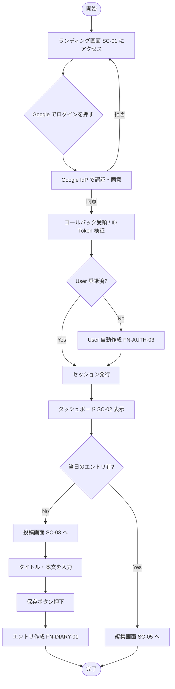
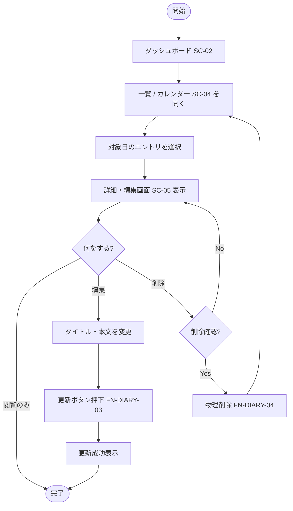

# 業務フロー（アクティビティ図）

利用者から見た主要シナリオの流れ。

| ファイル | シナリオ | 対応シナリオID |
|---|---|---|
| [`signup-and-first-post.mmd`](signup-and-first-post.mmd) | 初回登録〜初回投稿 | SC-USE-01 |
| [`edit-past-entry.mmd`](edit-past-entry.mmd) | 過去日記の振り返り編集 | SC-USE-03 |

## 初回登録〜初回投稿

## 過去日記の振り返り編集

