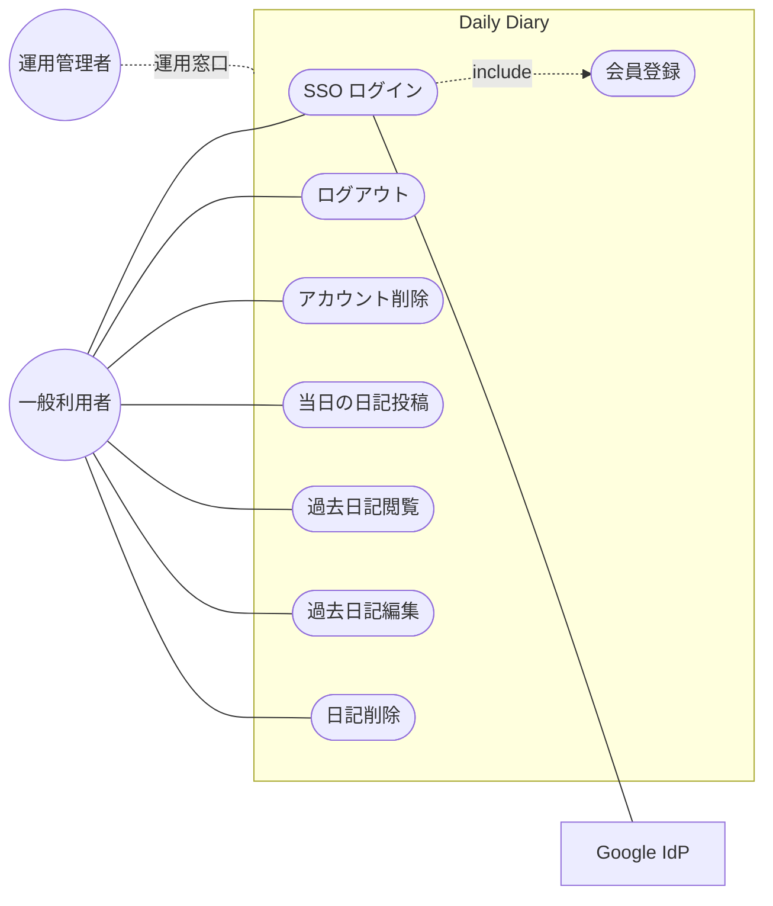

# ユースケース図

Daily Diary の機能要件（誰が何をできるか）を表現するユースケース図。

- ソースファイル: [`use-case.mmd`](use-case.mmd)

## アクター

| アクター | 説明 |
|---|---|
| 一般利用者 (User) | 日記を書く / 読む人。アプリの主アクター |
| Google IdP | 外部認証プロバイダ。SSO ログインに利用 |
| 運用管理者 (Admin) | 障害対応・通報対応。MVP では UI なし（運用手順のみ） |

## ユースケース一覧

機能ID と1対1で対応する。詳細は [要件定義書 §5.2](../要件定義書.md#52-機能一覧) を参照。

| 機能ID | ユースケース |
|---|---|
| FN-AUTH-01 | SSO ログイン |
| FN-AUTH-02 | ログアウト |
| FN-AUTH-03 | 会員登録（初回ログイン時に自動） |
| FN-AUTH-04 | アカウント削除 |
| FN-DIARY-01 | 当日の日記投稿 |
| FN-DIARY-02 | 過去日記閲覧 |
| FN-DIARY-03 | 過去日記編集 |
| FN-DIARY-04 | 日記削除 |

## 図

> Mermaid のユースケース表現は `flowchart` で代用している（標準のユースケース図記法がないため）。`(())` をアクター、`([...])` をユースケースと読み替えてほしい。PlantUML 版が必要になれば併設する。
